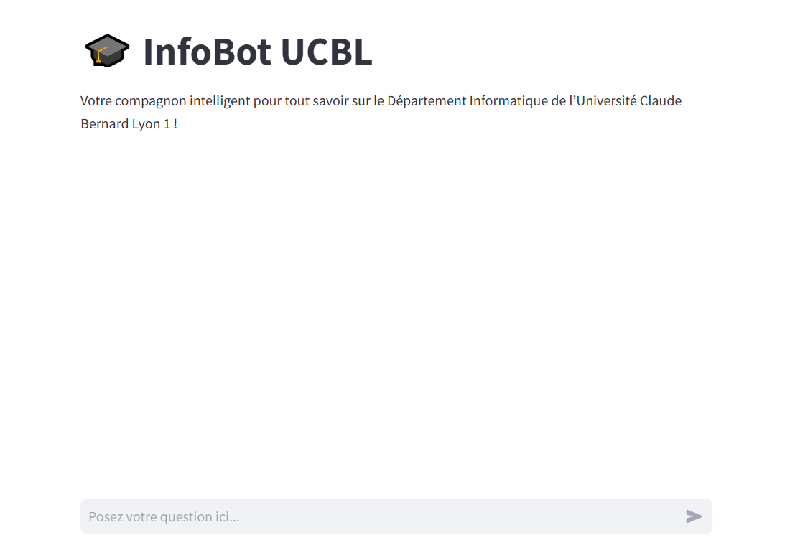
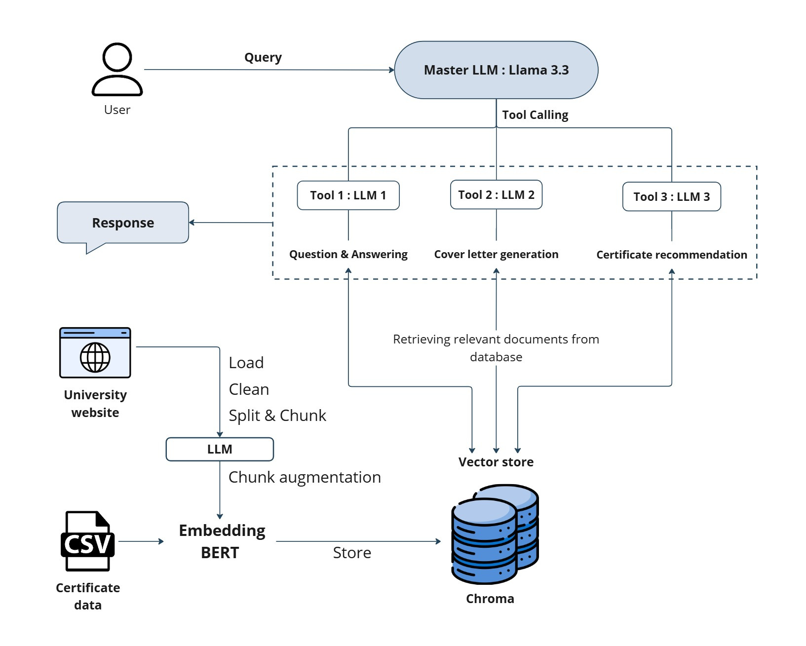

# InfoBot UCBL - README

<div align="center">
  
  <br>
  <a href="https://youtu.be/LRIYxuCFwNQ" target="_blank">InfoBot UCBL - Demo video</a>
</div>

## Objective
InfoBot UCBL is a chatbot powered a Large Language Models (LLM) using Retrieval-Augmented Generation (RAG) on university web pages. It is designed to assist students by providing accurate, up-to-date and context-aware information about the Computer Science Department at Claude Bernard Lyon 1 University. The chatbot answers academic queries, supports cover letter template creation, and offers tailored certification recommendations from Coursera, simplifying access to institutional resources.

## Features
- **Question & answering**: The chatbot can retrieve precise information about academic programs, research facilities, and opportunities at the university.
- **Cover letter assistance**: The chatbot can suggest skills and experiences tailored to specific programs or roles.
- **Certification recommendations**: The chatbot can identify relevant certifications to enhance academic and professional profiles.

## Technologies
1. **LangChain**:
   - Used for data loading, chunking, and efficient retrieval mechanisms.
   - Documentation: [LangChain](https://www.langchain.com/docs)
   
2. **Markdownify**:
   - Used to convert HTML web pages into clean and structured Markdown format.
   - Documentation: [Markdownify](https://pypi.org/project/markdownify/)
   
3. **Sentence-Transformers (SBERT)**:
   - Embedding model used to vectorize documents for semantic search.
   - Documentation: [Sentence-Transformers](https://www.sbert.net/)
   
4. **Chroma**:
   - Vector database for fast and accurate retrieval of context-relevant data.
   - Documentation: [Chroma](https://docs.trychroma.com/)
   
5. **Llama 3.3**:
   - Large language Model used for question generation, context retrieval, and response generation.
   - Documentation: [Llama Models](https://ai.meta.com/llama/)

6. **Groq**:
   - API used for accessing the Large Language Model (LLM).
   - Documentation: [Groq](https://www.groq.com/)
   
7. **Streamlit**:
   - Framework used to build the application interface.
   - Documentation: [Streamlit](https://docs.streamlit.io/)

## Process & system architecture
1. **Data collection**: Extracts information from the Computer Science Department's web pages and Coursera certifications.
2. **Data preprocessing**: Cleans, structures, and converts the data into Markdown format using Markdownify.
3. **Data chunking & augmentation**: Splits data into manageable chunks and augments each chunk with questions summarizing its content.
4. **Data embedding & storage**: Vectorizes the data using Sentence-Transformers and stores it in Chroma databases.
5. **Query handling**: Uses RAG to fetch relevant context for queries, enabling the chatbot to provide accurate and meaningful responses.



## Running the application
To run the application, follow the steps below:
1. **API key**: 
    - You will need a Groq API key to access the Language Model (LLM). Ensure that you have the necessary API key.
2. **Install requirements**:
    - Open the runApp.ipynb file.
    - Install the required dependencies listed in the notebook.
5. **Download public IP**:
    - Run the following command to get the public IP address: ```!wget -q -O - ipv4.canhazip.com```
7. **Start the application**:
    - Once the requirements are installed, use the following command to start the Streamlit application: ```!streamlit run app.py & npx localtunnel --port 8501```
    - This will launch the application and make it accessible via a public URL generated by LocalTunnel.

## Future improvements
We aim to enhance the chatbot's accuracy and expand its capabilities with the following improvements:
- **Graph-based RAG**: Implementing graph-based RAG created by extracting entities and relationships from the dataset using an LLM to create a knowledge graph. This graph will serve as an additional context base, improving the quality and precision of the chatbot's responses.
- **University-wide extension**: Extending the chatbot's coverage to include the entire Claude Bernard Lyon 1 University, allowing students from all departments to benefit from tailored support.
- **National expansion**: In the long term, scale the product to cover all universities in France, creating a comprehensive educational knowledge graph to revolutionize access to academic and institutional information.

## Video demonstration
Watch our [YouTube video](https://youtu.be/LRIYxuCFwNQ) for a demonstration of InfoBot UCBL in action. The video showcases the chatbot's features, its interface, and how it effectively handles various queries.

## Repository
The implementation is available on GitHub: [InfoBot UCBL](https://github.com/oumayma-yakoubi/InfoBotUCBL).

## Contact
For questions or contributions, please reach out via the [GitHub repository](https://github.com/oumayma-yakoubi/InfoBotUCBL).

<br>

#### Group members
- Yakoubi Oumayma : oumayma.yakoubi@etu.univ-lyon1.fr
- Ridouan Aafaf : aafaf.ridouan@etu.univ-lyon1.fr
- Liroulet Inès : ines.liroulet@etu.univ-lyon1.fr

#### This is a submission for CC3 of the LLM unit taught by [Dr. Bruno YUN](https://bruno-yun.notion.site/) at Claude Bernard Lyon 1 University.